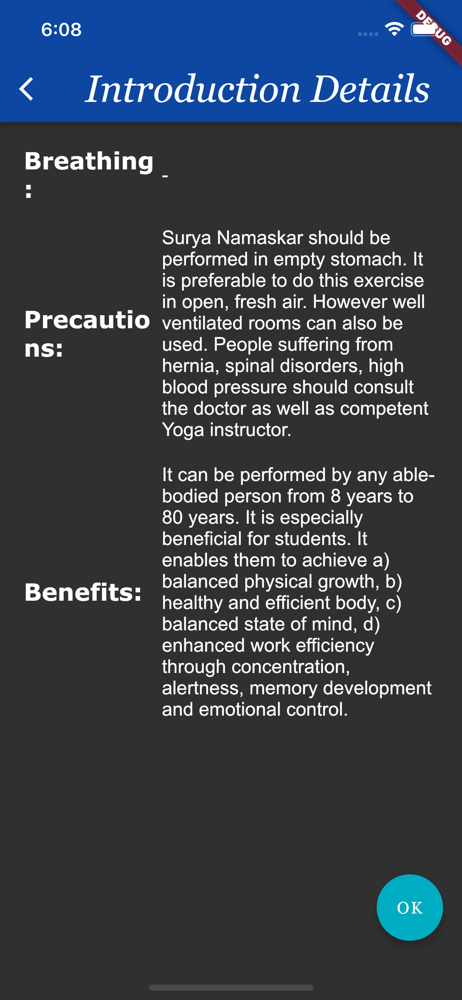
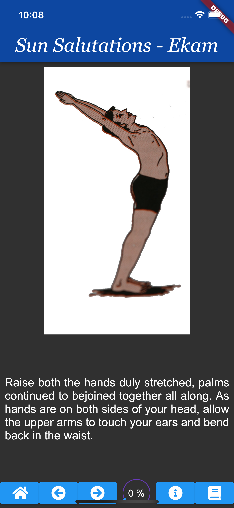
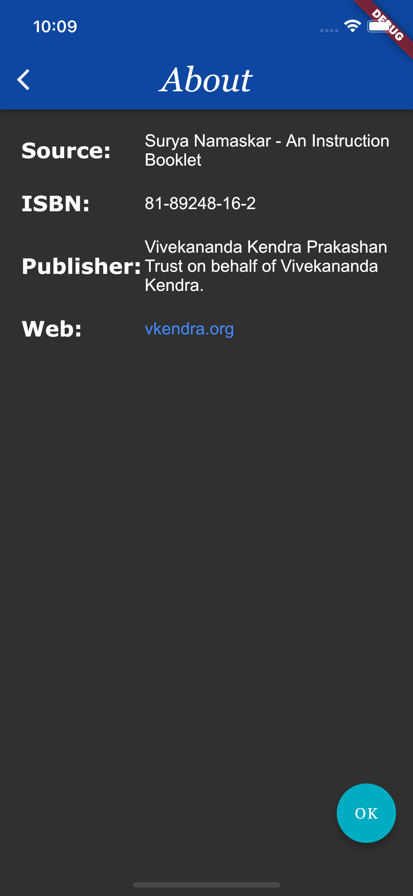

# surya_namaskar

An exercise in flutter and UI design. The task is to improve this yoga app (forked from [here](https://github.com/rama-swuni/surya_namaskar)).

| Home       | Details      | A pose    | Resources Page |
| -----------| -------------| --------- | -------------- |
|  |  |  |  |

It is a simple mobile app to do with [Sun Salutation](https://en.wikipedia.org/wiki/Sun_Salutation) yoga exercise.

